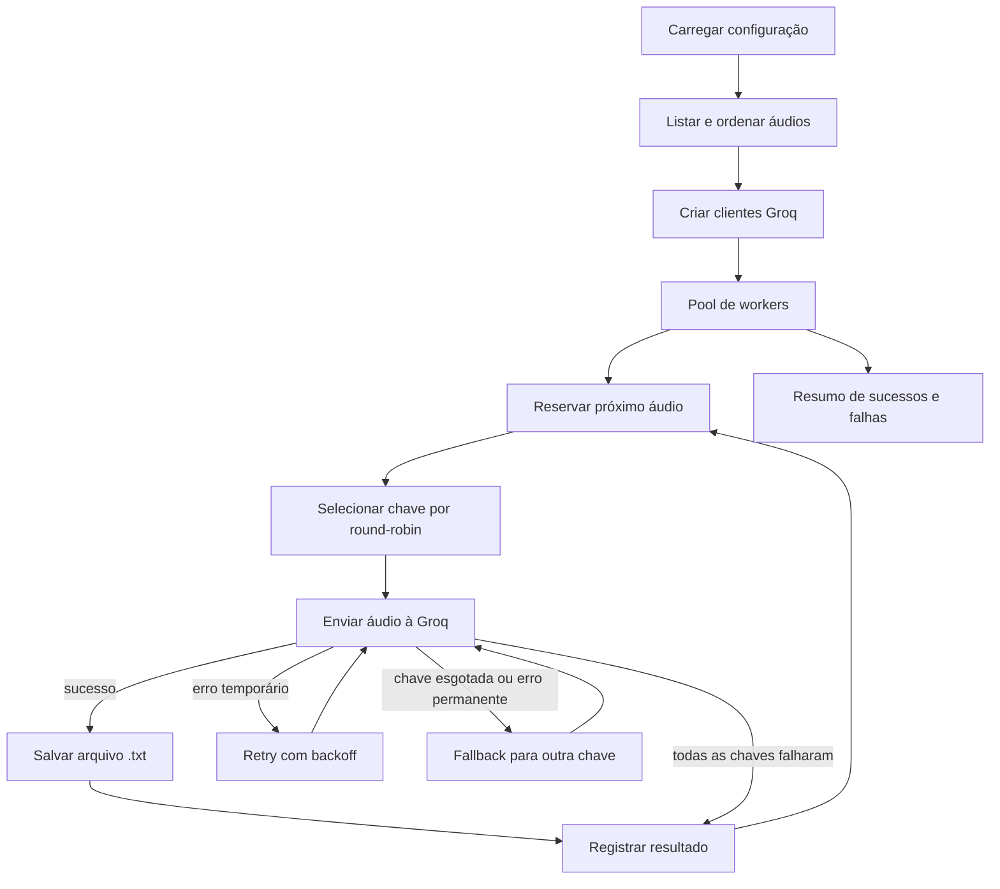

# Contexto arquitetural — Groq Transcription Router

## 1. Propósito

Este projeto é um roteador local de transcrição de áudio. Ele recebe arquivos da pasta `audios`, distribui o trabalho entre uma ou mais chaves Groq, aplica retry e fallback e grava os textos resultantes em `transcricoes`.

Este documento tem dois objetivos:

1. registrar com precisão a arquitetura que existe hoje;
2. definir os limites para criar novos modos sem depender de credenciais locais ou acoplar todo o sistema à API da Groq.

O princípio para a evolução do projeto é:

> O núcleo do roteador deve poder ser desenvolvido e testado sem rede e sem API keys. Somente o adaptador `live`, habilitado no ambiente de deploy, deve fazer chamadas externas à Groq.

## 2. Estado atual

O projeto usa Node.js 20 ou superior, JavaScript com ES Modules, `dotenv` e o SDK oficial `groq-sdk`.

Estrutura principal:

```text
groq-transcription-router/
├── audios/                  # arquivos que serão processados
├── benchmark/
│   └── router-load.js       # carga simulada, sem chamadas à Groq
├── src/
│   └── transcribe.js        # configuração, roteamento e execução atual
├── transcricoes/            # arquivos .txt gerados
├── .env                     # segredos locais; não deve ser commitado
├── .gitignore
├── package.json
└── contexto.md
```

Comandos existentes:

```bash
npm run transcribe
npm run benchmark
```

- `npm run transcribe` é o modo real atual. Ele lê áudios, acessa a Groq e grava transcrições.
- `npm run benchmark` é totalmente simulado. Ele não usa chaves, não acessa a Groq, não lê os áudios reais e não grava transcrições.

## 3. Fluxo atual de transcrição



### 3.1 Descoberta de arquivos

`listAudioFiles()` lê `audios`, ignora diretórios e arquivos não suportados e ordena os nomes. Os formatos aceitos atualmente são:

- `.flac`
- `.mp3`
- `.mp4`
- `.mpeg`
- `.mpga`
- `.m4a`
- `.ogg`
- `.wav`
- `.webm`

O nome de saída mantém o nome-base e troca a extensão por `.txt`.

Exemplo:

```text
audios/reuniao.ogg -> transcricoes/reuniao.txt
```

Um arquivo de saída existente com o mesmo nome é sobrescrito.

### 3.2 Configuração e chaves

As chaves reconhecidas seguem estritamente o padrão:

```text
GROQ_API_KEY_1
GROQ_API_KEY_2
GROQ_API_KEY_3
...
```

Chaves vazias são ignoradas. As chaves válidas são ordenadas pelo sufixo numérico e representadas nos logs somente como `KEY 1`, `KEY 2`, etc.

O código nunca deve imprimir, persistir ou incluir a chave real em erros. Antes de exibir uma mensagem, `readableError()` substitui qualquer chave configurada por `[CHAVE OCULTA]`.

### 3.3 Round-robin

O índice do áudio define sua chave inicial:

```text
chave inicial = índice do áudio % quantidade de chaves
```

Com três chaves:

```text
áudio 1 -> KEY 1
áudio 2 -> KEY 2
áudio 3 -> KEY 3
áudio 4 -> KEY 1
```

Como o índice é reservado de forma síncrona antes do processamento assíncrono, a escolha inicial não depende da ordem em que as requisições terminam.

### 3.4 Retry

Cada chave recebe uma tentativa inicial e, no máximo, duas novas tentativas. Portanto, o máximo é de três chamadas por chave para o mesmo áudio.

São considerados temporários:

- timeout de conexão;
- erros de rede conhecidos;
- HTTP 408;
- HTTP 429;
- HTTP 5xx.

O backoff padrão é curto e crescente. Quando a resposta contém `retry-after` ou `retry-after-ms`, o valor é respeitado se estiver entre zero e 30 segundos.

O retry automático interno do SDK é desabilitado com `maxRetries: 0`. Isso evita retries duplicados e mantém o limite sob controle do roteador.

### 3.5 Fallback

Quando uma chave falha definitivamente para um áudio, o roteador tenta as demais chaves na sequência circular. A mesma chave não é repetida no ciclo de fallback daquele áudio.

Uma falha de gravação local não aciona fallback, porque trocar de chave não corrigiria um problema no filesystem e poderia gerar chamadas externas duplicadas.

### 3.6 Concorrência

`TRANSCRIPTION_CONCURRENCY` controla o número máximo de áudios processados ao mesmo tempo. O padrão é `4`.

O pool cria apenas a quantidade configurada de workers. Cada worker:

1. reserva o próximo índice pendente;
2. processa um áudio por completo;
3. aguarda retries e fallbacks daquele áudio;
4. somente então busca outro áudio.

Nunca existem duas tentativas simultâneas do mesmo áudio. O array de resultados usa uma posição exclusiva por áudio, e os totais são calculados apenas depois que todos os workers terminam.

Importante: concorrência de áudios não significa limite por chave. Se houver mais workers do que chaves, uma mesma chave poderá atender áudios diferentes simultaneamente.

## 4. Pontos de extensão existentes

`src/transcribe.js` exporta:

```js
processAudio(options)
runWorkerPool(options)
```

O pool e o processamento aceitam handlers injetáveis:

```js
runWorkerPool({
  audioFiles,
  concurrency,
  routes,
  apiKeys,
  requestHandler,
  saveHandler,
  waitHandler,
});
```

Contratos atuais:

```js
// Deve retornar somente o texto transcrito.
async function requestHandler(client, audioFile) {
  return "texto";
}

// Decide onde e como persistir o resultado.
async function saveHandler(audioFile, text) {}

// Controla a espera de backoff.
async function waitHandler(milliseconds) {}
```

Esses pontos permitem substituir rede, persistência e relógio em testes. O benchmark já usa essa injeção para exercitar o mesmo pool, round-robin, retry e fallback sem chamar a Groq.

## 5. Modos de execução

### 5.1 Modos que existem hoje

| Modo | Rede externa | API key | Grava `.txt` | Finalidade |
|---|---:|---:|---:|---|
| `transcribe` | Sim | Sim | Sim | Execução real atual |
| `benchmark` | Não | Não | Não | Carga e validação do roteador |

### 5.2 Modos recomendados para evolução

Novos modos devem compartilhar o núcleo e trocar apenas adaptadores:

| Modo | Provider | Storage | Uso esperado |
|---|---|---|---|
| `mock` | resposta simulada | memória ou temporário | desenvolvimento local |
| `dry-run` | nenhuma chamada | nenhuma gravação | validar arquivos, rotas e configuração |
| `test` | falhas determinísticas | memória | testes automatizados |
| `benchmark` | latência/falhas simuladas | no-op | teste de carga |
| `live` | Groq | filesystem ou storage do deploy | ambiente autorizado |

Nenhum novo modo deve importar ou instanciar `Groq` diretamente. A dependência externa deve ficar atrás de um provider.

Interface-alvo sugerida:

```js
export function createTranscriptionProvider(config) {
  return {
    async transcribe({ audioFile, route }) {
      return { text: "..." };
    },
  };
}
```

O núcleo deve conhecer apenas o contrato `transcribe()`, e não detalhes do SDK.

## 6. Separação recomendada para os próximos passos

Atualmente, `src/transcribe.js` reúne configuração, provider Groq, políticas e CLI. Antes de adicionar muitos modos, recomenda-se separar sem mudar o comportamento:

```text
src/
├── cli/
│   └── transcribe.js            # entrada do comando
├── config/
│   └── load-config.js           # validação de ambiente
├── core/
│   ├── router.js                # round-robin e fallback
│   ├── retry-policy.js          # classificação e backoff
│   └── worker-pool.js           # concorrência
├── providers/
│   ├── groq-provider.js         # único módulo que conhece groq-sdk
│   └── mock-provider.js         # desenvolvimento e testes
└── storage/
    ├── filesystem-storage.js
    └── memory-storage.js
```

Regras de dependência:

```text
CLI -> configuração -> núcleo -> contratos
                           ^
provider Groq -------------|
provider mock -------------|
storage filesystem --------|
storage memory ------------|
```

O núcleo não deve importar `dotenv`, `groq-sdk` ou módulos específicos de deploy.

## 7. Segredos e `.env`

### 7.1 Regra de repositório

O arquivo `.env` contém segredos e nunca deve ser commitado. Atualmente, `.gitignore` contém:

```gitignore
.env
```

Antes de criar variantes locais, a proteção recomendada é:

```gitignore
.env
.env.*
!.env.example
```

Um eventual `.env.example` pode ser commitado somente com placeholders:

```env
TRANSCRIPTION_MODE=mock
TRANSCRIPTION_CONCURRENCY=4
GROQ_API_KEY_1=
GROQ_API_KEY_2=
```

Nunca copie valores reais para exemplos, documentação, testes, fixtures, logs ou mensagens de erro.

Antes de cada commit, verifique:

```bash
git status --short
git check-ignore -v .env
git diff --cached
```

Se uma chave for commitada ou publicada, ela deve ser revogada e substituída; apenas apagar o commit mais recente não torna o segredo seguro.

### 7.2 Limitação atual importante

Hoje, `loadApiKeys()` lê `envResult.parsed`, ou seja, as chaves parseadas do arquivo `.env`. Além disso, uma falha ao carregar esse arquivo interrompe o modo real.

Isso é adequado para o MVP local, mas ainda não atende ao objetivo de disponibilizar chamadas reais somente no deploy. Plataformas de deploy normalmente injetam segredos diretamente em `process.env`, sem criar um arquivo `.env`.

Antes do deploy, o carregador deve ser refatorado para:

1. aceitar variáveis injetadas em `process.env`;
2. usar `.env` apenas como conveniência opcional de desenvolvimento;
3. não exigir a existência física de `.env` em produção;
4. validar o modo antes de exigir chaves;
5. exigir chaves somente quando `TRANSCRIPTION_MODE=live`.

## 8. Gate do modo live

Para que chamadas reais fiquem disponíveis somente no deploy, a arquitetura-alvo deve exigir uma habilitação explícita:

```env
TRANSCRIPTION_MODE=live
```

Política recomendada:

```text
TRANSCRIPTION_MODE=mock      -> não aceita chamadas externas
TRANSCRIPTION_MODE=dry-run   -> não aceita chamadas externas
TRANSCRIPTION_MODE=test      -> não aceita chamadas externas
TRANSCRIPTION_MODE=benchmark -> não aceita chamadas externas
TRANSCRIPTION_MODE=live      -> permite provider Groq e exige GROQ_API_KEY_N
```

Além do modo, o deploy deve fornecer as chaves pelo gerenciador de segredos da plataforma. Não se deve copiar `.env` para a imagem, repositório, artefato ou pipeline.

Uma proteção adicional recomendada é usar uma variável exclusiva do ambiente de deploy, por exemplo `ALLOW_EXTERNAL_TRANSCRIPTION=true`, verificada junto com `TRANSCRIPTION_MODE=live`. Essa defesa ainda não está implementada.

## 9. Configuração de deploy esperada

Variáveis não secretas:

```env
TRANSCRIPTION_MODE=live
TRANSCRIPTION_CONCURRENCY=4
```

Segredos injetados pela plataforma:

```env
GROQ_API_KEY_1=<secret>
GROQ_API_KEY_2=<secret>
GROQ_API_KEY_3=<secret>
```

Recomendações:

- use o secret manager nativo da plataforma;
- limite acesso às chaves ao serviço de transcrição;
- mantenha ambientes de desenvolvimento, homologação e produção separados;
- nunca imprima o objeto completo de configuração;
- aplique rotação periódica das chaves;
- não inclua valores de ambiente em relatórios de erro;
- bloqueie o modo `live` em CI e testes locais.

## 10. Benchmark e testes sem credenciais

O benchmark executa quatro perfis:

- `normal`;
- `retry-429`;
- `fallback-auth`;
- `misto`.

Ele valida automaticamente:

- pico de concorrência menor ou igual ao limite;
- chave inicial correta no round-robin;
- ausência de tentativas simultâneas do mesmo áudio;
- métricas de tentativas, retries, fallbacks, sucessos e falhas.

Execução padrão:

```bash
npm run benchmark
```

Carga personalizada no PowerShell:

```powershell
$env:BENCHMARK_JOBS=500
$env:BENCHMARK_KEYS=5
$env:BENCHMARK_CONCURRENCIES="1,4,8,16"
$env:BENCHMARK_LATENCY_MS=20
npm run benchmark
```

Essas variáveis pertencem ao processo do benchmark e não precisam ser adicionadas ao `.env`.

## 11. Como adicionar um novo modo

Ao criar um modo relacionado ao roteador:

1. defina claramente se ele pode usar rede;
2. implemente ou reutilize um `requestHandler`/provider;
3. implemente o storage apropriado;
4. reutilize `runWorkerPool()` em vez de criar concorrência paralela própria;
5. preserve a escolha inicial por round-robin;
6. preserve uma tentativa por vez para cada áudio;
7. classifique erros antes de aplicar retry;
8. sanitize mensagens antes de registrar erros;
9. teste sem credenciais usando handlers simulados;
10. impeça o provider Groq de ser carregado em modos não live.

Checklist mínimo para merge:

- [ ] funciona sem `.env` quando o modo não é live;
- [ ] não imprime chaves ou configuração sensível;
- [ ] não chama rede em testes e benchmark;
- [ ] respeita o limite de concorrência;
- [ ] não executa tentativas paralelas do mesmo áudio;
- [ ] possui cenário de sucesso e falha;
- [ ] mantém retry e fallback determinísticos;
- [ ] não altera nomes de saída sem decisão explícita;
- [ ] documenta novas variáveis de ambiente.

## 12. Limitações conhecidas

- Não há fila persistente, banco de dados ou recuperação após reinício.
- O estado de saúde das chaves não é mantido entre áudios ou execuções.
- Uma chave inválida pode ser tentada novamente por outros áudios.
- Não existe limite de concorrência por chave.
- Arquivos com o mesmo nome-base sobrescrevem a mesma saída.
- O comando real processa todos os áudios válidos da pasta.
- Áudios e transcrições podem conter dados sensíveis e atualmente não estão cobertos pelo `.gitignore`.
- O gate `TRANSCRIPTION_MODE=live` ainda é uma decisão arquitetural, não uma proteção implementada.
- A configuração atual ainda depende da existência de `.env` para o modo real.

## 13. Próxima evolução recomendada

A próxima mudança estrutural deve ser pequena e sem alterar o algoritmo:

1. extrair configuração, núcleo, provider e storage para módulos separados;
2. tornar `.env` opcional e suportar secrets injetados em `process.env`;
3. implementar `TRANSCRIPTION_MODE` com padrão seguro, como `mock`;
4. permitir o provider Groq somente em `live`;
5. adicionar testes automatizados para retry, fallback, round-robin e concorrência;
6. decidir se `audios/` e `transcricoes/` devem ser ignorados pelo Git.

Até essa separação ocorrer, novos recursos devem usar os handlers injetáveis existentes e evitar adicionar mais dependências externas diretamente em `src/transcribe.js`.
